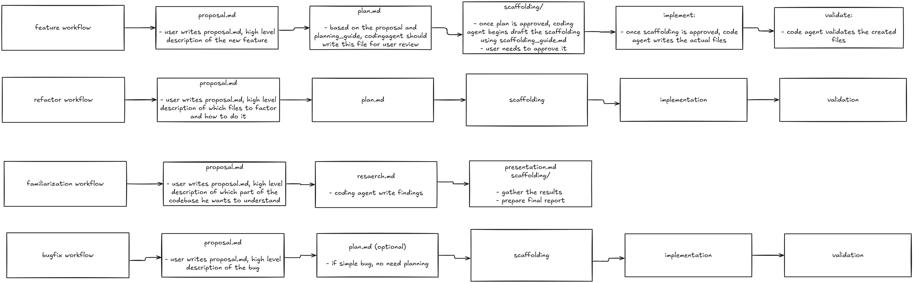
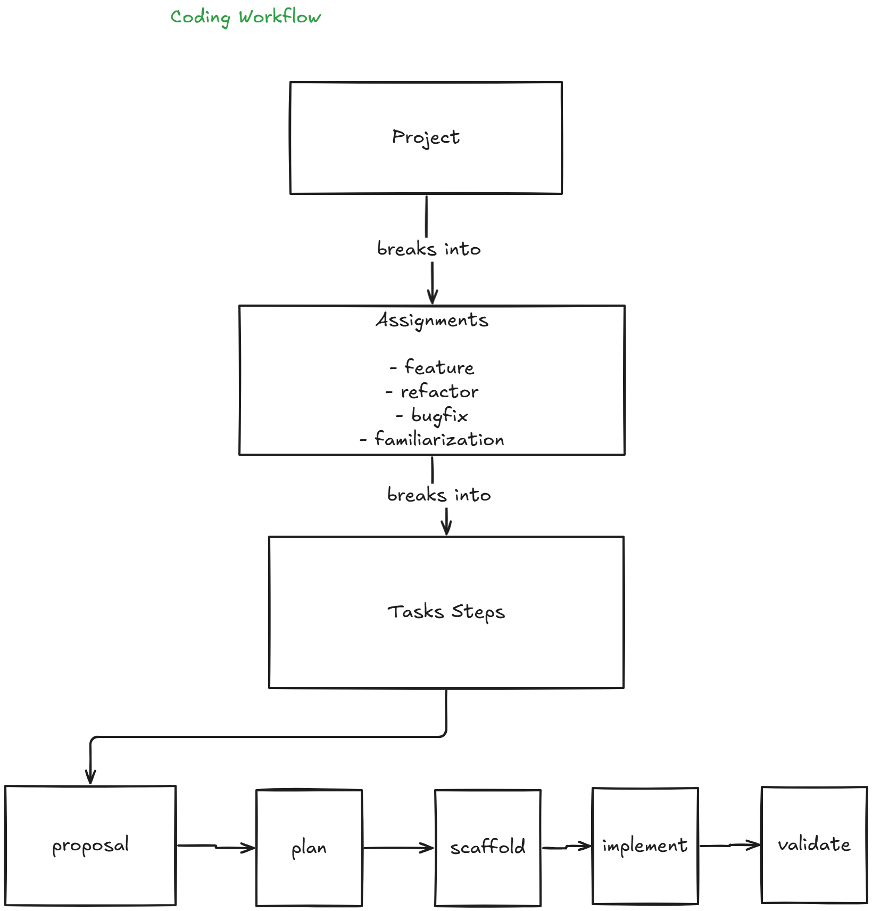
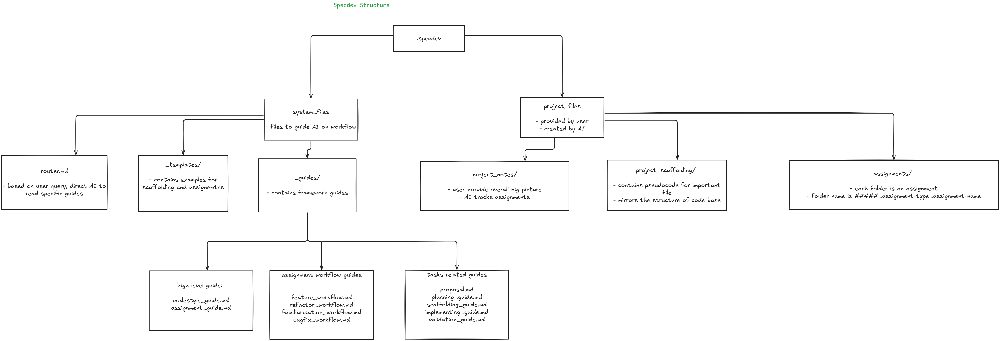

# SpecDev CLI

This is a watered down version of speckit, stripping all the unnecessary complexities.

Initialize the SpecDev workflow system in any project. SpecDev provides structured markdown-based guides for coding agents. 




## Quick Start

```bash
# Install from GitHub
npm install -g github:leiwu0227/specdev-cli
specdev init
```

## Installation Options

### Option 1: Install from GitHub (Recommended)
```bash
npm install -g github:leiwu0227/specdev-cli
specdev init
```

### Option 2: Clone and Link Locally
```bash
git clone https://github.com/leiwu0227/specdev-cli.git
cd specdev-cli
npm install
npm link
specdev init
```

### Option 3: Use npx directly (No installation)
```bash
npx github:leiwu0227/specdev-cli init
```

### Option 4: From npm (when published)
```bash
# One-time use
npx @specdev/cli init

# Global install
npm install -g @specdev/cli
specdev init
```

## Commands

### `specdev init`
Initialize `.specdev` folder in the current directory.

**Options:**
- `--force`, `-f` - Overwrite existing `.specdev` folder
- `--dry-run` - Show what would be copied without actually copying
- `--target=<path>` - Specify target directory (default: current directory)

**Examples:**
```bash
# Initialize in current directory
specdev init

# Overwrite existing
specdev init --force

# Initialize in specific directory
specdev init --target=./my-project

# Preview what would be created
specdev init --dry-run
```

### `specdev help`
Show help message with all available commands.

### `specdev --version`, `specdev -v`
Show the installed version.

## What Gets Created

```
.specdev/
├── main.md                                # SpecDev overview
├── router.md                              # Central routing guide
├── _guides/                               # Guide library
│   ├── assignment_guide.md               # Assignment workflow
│   ├── codestyle_guide.md                # Coding philosophy
│   ├── task/                             # Task-level guides
│   │   ├── planning_guide.md             # Planning phase
│   │   ├── scaffolding_guide.md          # Scaffolding format
│   │   ├── implementing_guide.md         # Implementation
│   │   ├── validation_guide.md           # Quality gates (Gates 1-4)
│   │   ├── documentation_guide.md        # Documentation updates
│   │   ├── research_guide.md             # Research (familiarization)
│   │   └── presentation_guide.md         # Presentation (familiarization)
│   └── workflow/                         # Assignment-type workflows
│       ├── feature_workflow.md           # Building features
│       ├── refactor_workflow.md          # Restructuring code
│       ├── bugfix_workflow.md            # Fixing defects
│       └── familiarization_workflow.md   # Learning code
├── project_notes/                         # Project documentation
│   ├── big_picture.md                    # Project goals
│   ├── assignment_progress.md            # Assignment tracking
│   └── feature_descriptions.md           # What's built catalog
├── project_scaffolding/                   # Source code mirror
│   └── README.md                         # Scaffolding guide
├── _templates/                            # Templates
│   ├── gate_checklist.md                 # Quality gate checklist
│   ├── scaffolding_template.md           # Scaffolding format
│   └── assignment_examples/              # Worked examples
│       └── feature/
│           └── 00000_feature_email-validator/
│               ├── proposal.md
│               ├── plan.md
│               ├── implementation.md
│               ├── validation_checklist.md
│               └── scaffold/
└── assignments/                           # Active work
    └── .gitkeep
```

## Workflow Overview

SpecDev provides structured workflows for different assignment types:

### Assignment Types

**Feature** - Building new capabilities
1. Proposal → 2. Plan → 3. Scaffolding (Gate 1) → 4. Implementation (Gate 2) → 5. Validation (Gates 3-4) → 6. Finalize

**Refactor** - Restructuring without behavior change
1. Proposal → 2. Plan → 3. Scaffolding (Gate 1) → 4. Implementation (Gate 2) → 5. Validation (Gates 3-4) → 6. Finalize

**Bugfix** - Diagnosing and fixing defects
1. Proposal → 2. Plan [optional] → 3. Scaffolding (Gate 1) → 4. Implementation (Gate 2) → 5. Validation (Gates 3-4) → 6. Finalize

**Familiarization** - Learning unfamiliar code
1. Proposal → 2. Research → 3. Presentation → 4. Finalize

### Quality Gates

- **Gate 1:** Scaffolding approval (before implementation)
- **Gate 2:** Per-task validation (during implementation)
- **Gate 3:** Testing (unit tests, coverage)
- **Gate 4:** Integration (end-to-end, no breaking changes)
- **Finalize:** Documentation updates (feature_descriptions.md, project_scaffolding)

See `.specdev/_templates/assignment_examples/` for complete worked examples.

## Getting Started

After running `specdev init`:

1. **Read the router**: Start with `.specdev/router.md` to understand the workflow
2. **Read the overview**: Check `.specdev/main.md` for SpecDev overview
3. **Update project info**: Edit `.specdev/project_notes/big_picture.md`
4. **Review examples**: Check `.specdev/_templates/assignment_examples/`
5. **Start your first assignment**: Create a `proposal.md` in `.specdev/assignments/00001_type_name/`

## Assignment Structure

Assignments use the format `#####_type_name` (e.g., `00001_feature_auth-flow`):

```
.specdev/assignments/00001_feature_auth-flow/
├── proposal.md              # User-provided high-level description
├── plan.md                  # Detailed implementation plan
├── research.md              # Optional research notes
├── implementation.md        # Task-by-task todo list
├── validation_checklist.md  # Quality gates tracking
└── scaffold/                # Scaffolding documents
    ├── auth_login.md
    └── auth_token.md
```

## Development

### Setup
```bash
git clone https://github.com/leiwu0227/specdev-cli.git
cd specdev-cli
npm install
```

### Testing
```bash
# Run all tests
npm test

# Test init command
npm run test:init

# Verify output
npm run test:verify

# Lint code
npm run lint

# Format code
npm run format
```

### Local Testing
```bash
# Link package locally
npm link

# Test in another directory
cd /path/to/test/project
specdev init
```

### Release
```bash
# Patch version (1.0.0 -> 1.0.1)
npm run release

# Minor version (1.0.0 -> 1.1.0)
npm run release:minor

# Major version (1.0.0 -> 2.0.0)
npm run release:major
```

## Updating Templates

1. Edit files in `templates/.specdev/`
2. Run `npm test` to verify
3. Bump version: `npm run release`
4. Publish: `npm publish --access public`

## Key Features

- **Assignment-first approach**: All work happens through structured assignments
- **Quality gates**: Validation checkpoints ensure quality at each step
- **Task vs Workflow guides**: Repeatable steps + domain-specific sequencing
- **Living documentation**: feature_descriptions.md, project_scaffolding stay synchronized
- **Multiple assignment types**: Feature, Refactor, Bugfix, Familiarization workflows

## Contributing

Contributions are welcome! Please:

1. Fork the repository
2. Create a feature branch
3. Make your changes
4. Run tests: `npm test`
5. Submit a pull request

## License

MIT

## Support

- Issues: [GitHub Issues](https://github.com/leiwu0227/specdev-cli/issues)
- Documentation: See `.specdev/` folder after initialization

## Changelog

See [CHANGELOG.md](CHANGELOG.md) for version history.

## Diagrams



