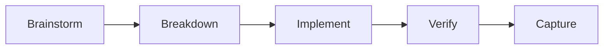

# SpecDev CLI

Spec-driven workflow guidance for coding agents. 5-phase CLI-driven workflow: TDD enforcement, subagent dispatch, and phase-aware review coordination.



## Quick Start

```bash
npm install -g github:leiwu0227/specdev-cli
specdev init --platform=claude
```

With `--platform=claude`, slash-command skills are installed to `.claude/skills/`. Use `/specdev-start` to fill in your project context interactively, then `/specdev-assignment` to begin your first feature.

For other platforms, fill in `.specdev/project_notes/big_picture.md` manually, then ask your coding agent to read `.specdev/_main.md`.

## Commands

### CLI commands (run from terminal)

These commands perform filesystem operations and are useful on their own without a coding agent.

```bash
specdev init [--platform=claude]    # Initialize .specdev in current directory
specdev update                      # Update core skills, preserve project files
specdev migrate [--dry-run]         # Migrate legacy assignments to V4 layout
specdev skills                      # List available skills
specdev help                        # Show usage information
```

### Agent-directed commands (run inside a coding agent)

These commands validate state, set up directories, then print instructions that route the coding agent to the appropriate skill.

```bash
specdev assignment [name]           # Create assignment, route agent to brainstorming skill
specdev breakdown                   # Validate brainstorm artifacts, route agent to breakdown skill
specdev implement                   # Validate plan artifacts, route agent to implementing skill
```

### Either context (useful in both terminal and agent sessions)

```bash
specdev start                       # Check/fill project context (display or agent guidance)
specdev continue [--json]           # Detect current state, blockers, and next action
specdev review                      # Phase-aware review guidance (same or separate session)
```

### Interactive commands (require human input at a terminal)

```bash
specdev ponder workflow             # Review assignments, accept/reject workflow observations
specdev ponder project              # Review assignments, accept/reject project learnings
```

## What gets created

```text
.specdev/
├── _main.md                  # Workflow entry point (start here)
├── _router.md                # Routes to correct skill
├── _guides/                  # Workflow and task guides
├── _templates/               # Templates and worked examples
├── skills/
│   ├── core/                 # Phase skills + supporting skills (managed by specdev update)
│   └── tools/                # Project-specific tool skills (user-owned)
├── knowledge/                # Long-term project knowledge
├── project_notes/            # Project context and progress
├── project_scaffolding/      # Source mirror metadata
└── assignments/              # Active work
```

## Workflow Architecture

SpecDev guides a single coding agent through a 5-phase workflow. Each phase is driven by a CLI command that validates the previous phase's output, then hands the agent the appropriate skill.

The agent runs interactively during brainstorm and review, and automatically during breakdown and implementation. Review can be run in the same session or a separate one via `specdev review`.

## The 5 Phases

All work happens through assignments in `.specdev/assignments/<id>/`.

### 1. Brainstorm

Skill: `skills/core/brainstorming/SKILL.md`

Interactive Q&A with the user to validate scope and design. One question at a time, design sections validated incrementally.

**Produces:** `brainstorm/proposal.md` + `brainstorm/design.md`

### 2. Breakdown

Skill: `skills/core/breakdown/SKILL.md`

Automatic decomposition of the design into executable TDD tasks. Each task is small, self-contained, and includes exact file paths, code, and commands.

**Produces:** `breakdown/plan.md`

### 3. Implement

Skill: `skills/core/implementing/SKILL.md`

A fresh subagent is dispatched per task. Each subagent follows strict TDD (Red-Green-Refactor) and goes through two per-task reviews (spec compliance, then code quality) before the task is considered done.

Tasks can declare skills via the `Skills:` field in the plan, and those skill contents are injected into the subagent prompt.

**Produces:** committed code per task, `implementation/progress.json`

When done: run `specdev review` to start inline review, or open a separate session.

### 4. Verify

Skill: `skills/core/review-agent/SKILL.md`

Can run in the same session or a **separate session** via `specdev review`. The review agent runs preflight checks and performs a single holistic review covering both spec compliance and code quality.

Up to 3 review rounds. Communication happens through `review_request.json` (status, progress, verdict).

**Produces:** `review_report.md`

### 5. Capture

Skill: `skills/core/knowledge-capture/SKILL.md`

Automatic distillation of learnings after the assignment is complete.

**Produces:** `knowledge/project-notes-diff.md` (documentation gaps) + `knowledge/workflow-diff.md` (workflow observations)

## Assignment Folder Structure

```text
.specdev/assignments/<id>/
├── brainstorm/
│   ├── proposal.md              # What was requested
│   └── design.md                # Validated design
├── breakdown/
│   └── plan.md                  # Executable task list
├── implementation/
│   └── progress.json            # Task completion tracking
├── review_request.json          # Review coordination (status, gate, changed files)
├── review_progress.json         # File-by-file review progress
└── review_report.md             # Review findings
```

## Skills Model

Skills are modular capabilities in `.specdev/skills/`:

```text
skills/core/<name>/
  SKILL.md        # The manual (with frontmatter)
  scripts/        # Deterministic tools (bash)
  prompts/        # Subagent templates
```

**Core skills** (`skills/core/`) — managed by SpecDev, updated via `specdev update`:

| Skill | Type | Purpose |
|-------|------|---------|
| `brainstorming` | Phase | Interactive design Q&A |
| `breakdown` | Phase | Design to executable plan |
| `implementing` | Phase | Subagent dispatch + TDD |
| `review-agent` | Phase | Holistic review (separate session) |
| `knowledge-capture` | Phase | Post-assignment learning capture |
| `test-driven-development` | Supporting | Red-Green-Refactor enforcement |
| `systematic-debugging` | Supporting | Root-cause-first bugfix |
| `parallel-worktrees` | Supporting | Git worktree isolation |
| `orientation` | Supporting | Decision tree for skill selection |
| `verification-before-completion` | Always-apply | No claims without evidence |
| `receiving-code-review` | Always-apply | No performative agreement |
| `scaffolding-lite` / `scaffolding-full` | On-demand | Architecture prep |

**Tool skills** (`skills/tools/`) — user-owned, never overwritten by update. Project-specific tools, testing scripts, integrations.

## Updating

```bash
npm install -g github:leiwu0227/specdev-cli
specdev update
```

`specdev update` refreshes core skills and system guides while preserving project-specific files and customized tool skills.

## Acknowledgments

TDD enforcement and verification patterns adapted from [obra/superpowers](https://github.com/obra/superpowers).

## License

MIT
