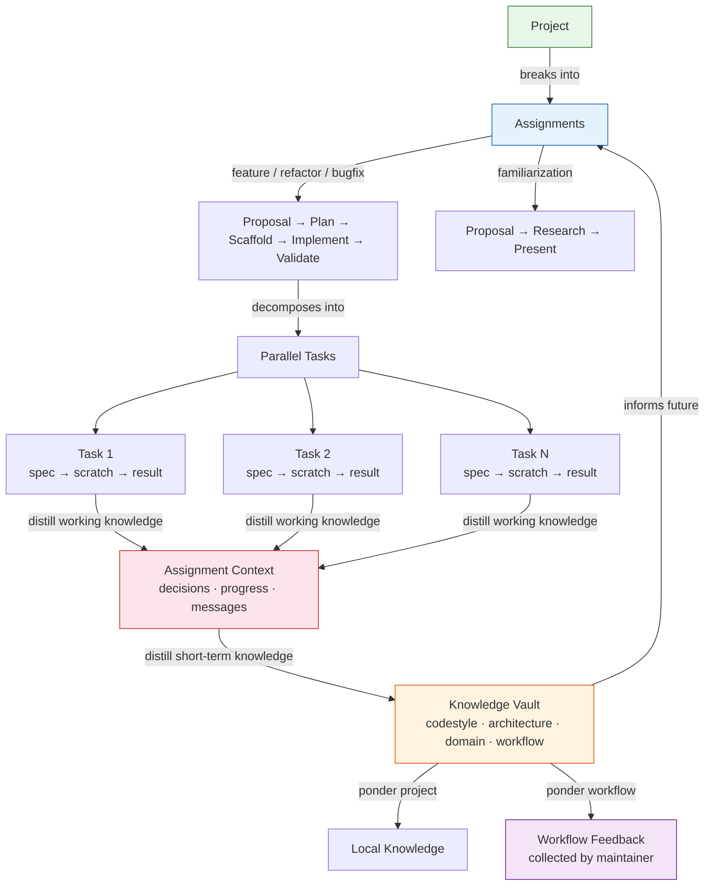

# SpecDev CLI

Adding spec-based guidance for coding agents to your project. A watered down version of Speckit.



## Quick Start

```bash
# Install globally
npm install -g github:leiwu0227/specdev-cli

# Initialize in your project
specdev init

# After setting up, ask your coding agent to read .specdev/_main.md to get started
```

## Getting Started

1. Ask your coding agent to read `.specdev/_main.md` to get started
2. Update `.specdev/project_notes/big_picture.md` with your project info
3. Start chatting with the coding agent

**Examples:**
- "I want to develop a new feature called ..."
- "I want to get familiar with the code base in this folder ..."
- "I want to refactor this file ..."
- "I want to fix this bug ..."

## Commands

```
specdev init                    # Scaffold .specdev/ into project
specdev update                  # Update system guides to latest
specdev ponder workflow         # Interactive: review & write workflow feedback
specdev ponder project          # Interactive: review & write local knowledge
specdev help                    # Show usage info
specdev --version               # Show version
```

### Options

| Flag | Description |
|------|-------------|
| `--force`, `-f` | Overwrite existing .specdev folder |
| `--dry-run` | Show what would be copied without copying |
| `--target=<path>` | Specify target directory (default: current) |

## What Gets Created

```
.specdev/
├── _main.md                    # System: SpecDev entry point for agents
├── _router.md                  # System: Central routing guide
├── _guides/                    # System: Task & workflow guides
├── _templates/                 # System: Scaffolding templates & examples
├── knowledge/                  # Project: Accumulated knowledge vault
│   ├── _index.md               #   Routing to knowledge branches
│   ├── _workflow_feedback/     #   Workflow improvement observations
│   ├── codestyle/              #   Naming, error handling, test patterns
│   ├── architecture/           #   Design patterns, dependencies, boundaries
│   ├── domain/                 #   Business domain concepts
│   └── workflow/               #   What worked/didn't in past assignments
├── project_notes/              # Project: Your documentation
├── project_scaffolding/        # Project: Source code mirror
│   └── _README.md              #   Scaffolding guide
└── assignments/                # Project: Your active work
```

**System** files (prefixed with `_`) are updated by `specdev update`. **Project** files are preserved.

## How It Works

All work happens through **assignments** in `.specdev/assignments/#####_type_name/`:

| Type | Flow |
|------|------|
| **Feature** | Proposal → Plan → Scaffold → Implement → Validate |
| **Refactor** | Proposal → Plan → Scaffold → Implement → Validate |
| **Bugfix** | Proposal → Plan → Scaffold → Implement → Validate |
| **Familiarization** | Proposal → Research → Present |

### Assignment Structure

Each assignment tracks its own context and can decompose into parallel tasks:

```
assignments/00001_feature_auth/
├── proposal.md
├── plan.md
├── context/                    # Short-term: decisions, progress, messages
│   ├── decisions.md
│   ├── progress.md
│   └── messages/               # Inter-agent communication
└── tasks/                      # Task decomposition for parallel work
    ├── _index.md               # Task list with status & dependencies
    └── 01_api/
        ├── spec.md             # What to do
        ├── scratch.md          # Working scratchpad
        └── result.md           # What was done
```

### Knowledge System

Knowledge accumulates at three levels:

| Level | Scope | Location |
|-------|-------|----------|
| **Working** | Current task | `tasks/*/scratch.md` — discarded on task completion |
| **Short-term** | Assignment | `context/` — decisions, progress, inter-agent messages |
| **Long-term** | Project | `knowledge/` — persists across assignments |

After each assignment, insights distill upward: working → short-term → long-term.

### Ponder Commands

Use `specdev ponder` to interactively reflect on completed work:

- **`specdev ponder workflow`** — scans assignments, suggests workflow-level observations (skipped phases, missing context, communication patterns), writes to `knowledge/_workflow_feedback/`
- **`specdev ponder project`** — scans assignments, suggests project-specific knowledge (codestyle, architecture, domain), writes to `knowledge/<branch>/`

Both commands present suggestions and let you accept, edit, reject, or add custom observations.

## Updating

When a new version is available:

```bash
# Update the CLI itself
npm install -g github:leiwu0227/specdev-cli

# Update system files in your project (preserves your project files)
specdev update
```

## License

MIT
