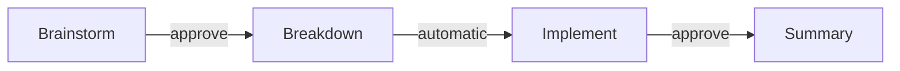

# SpecDev CLI

Spec-driven workflow guidance for coding agents. 4-phase CLI-driven workflow: TDD enforcement, subagent dispatch, and phase-aware review coordination.


```mermaid
graph LR
    B[Brainstorm] -->|approve| D[Breakdown]
    D -->|automatic| I[Implement]
    I -->|approve| S[Summary]
```

## Quick Start

```bash
npm install -g github:leiwu0227/specdev-cli
specdev init
```

Slash-command skills are installed to `.claude/skills/`. Use `/specdev-start` to fill in your project context interactively, then `/specdev-assignment` to begin your first feature.

For other platforms, fill in `.specdev/project_notes/big_picture.md` manually, then ask your coding agent to read `.specdev/_main.md`.

## Commands

### CLI commands (run from terminal)

```bash
specdev init                           # Initialize .specdev in current directory
specdev update                         # Update core skills, preserve project files
specdev migrate [--dry-run]            # Migrate legacy assignments to V4 layout
specdev skills                         # List available skills
specdev help                           # Show usage information
```

### Agent-directed commands (run inside a coding agent)

```bash
specdev assignment [name]              # Create assignment, route agent to brainstorming skill
specdev checkpoint <phase>             # Validate phase artifacts (brainstorm | implementation)
specdev approve <phase>                # Hard gate: approve phase and proceed
specdev reviewloop <phase>             # Automated external review loop (brainstorm | implementation)
specdev revise                         # Archive downstream artifacts, re-enter brainstorm
specdev check-review                   # Read and address review feedback
```

### Either context (useful in both terminal and agent sessions)

```bash
specdev start                          # Check/fill project context
specdev continue [--json]              # Detect current state, blockers, and next action
specdev review <phase>                 # Manual review in a separate session
```

### Knowledge distillation

```bash
specdev distill workflow               # Aggregate workflow observations from assignments
specdev distill project                # Aggregate project learnings from assignments
specdev distill mark-processed <type> <names>  # Mark assignments as distilled
```

## What gets created

```text
.specdev/
├── _main.md                  # Workflow entry point (start here)
├── _index.md                 # Detailed lookup for guides, skills, commands
├── _guides/                  # Workflow and task guides
├── _templates/               # Templates and worked examples
├── skills/
│   ├── core/                 # Phase skills + supporting skills (managed by specdev update)
│   └── tools/                # Tool skills (e.g., reviewloop — managed by specdev update)
├── knowledge/                # Long-term project knowledge
├── project_notes/            # Project context and progress
├── project_scaffolding/      # Source mirror metadata
└── assignments/              # Active work
```

## Workflow Architecture

SpecDev guides a single coding agent through a 4-phase workflow. Each phase produces specific artifacts. The CLI enforces hard gates between phases so work cannot advance until artifacts are validated and the user approves.

Breakdown and summary run automatically — the user only approves brainstorm and implementation. Optional review (manual or automated via reviewloop) can be run before either approval gate.

## The 4 Phases

All work happens through assignments in `.specdev/assignments/<id>/`.

### 1. Brainstorm

Skill: `skills/core/brainstorming/SKILL.md`

Interactive Q&A with the user to validate scope and design. Questions are guided by category (problem/goal, scope boundaries, success criteria, etc.). Design sections are scaled by assignment type (feature, bugfix, refactor, familiarization).

**Produces:** `brainstorm/proposal.md` + `brainstorm/design.md`

**Gate:** `specdev approve brainstorm` — breakdown begins automatically after approval.

### 2. Breakdown (automatic)

Skill: `skills/core/breakdown/SKILL.md`

Runs automatically after brainstorm approval. Decomposes the design into executable TDD tasks. Each task is small, self-contained, and includes exact file paths, code, and commands. Internal subagent review validates the plan (1-2 rounds).

**Produces:** `breakdown/plan.md`

### 3. Implement

Skill: `skills/core/implementing/SKILL.md`

A fresh subagent is dispatched per task. Each subagent follows strict TDD (Red-Green-Refactor) and goes through two per-task reviews (spec compliance, then code quality) before the task is considered done.

**Produces:** committed code per task, `implementation/progress.json`

**Gate:** `specdev approve implementation` — summary runs automatically after approval.

### 4. Summary (automatic)

Skill: `skills/core/knowledge-capture/SKILL.md`

Runs automatically after implementation approval. Distills learnings into workflow observations and documentation gaps.

**Produces:** `capture/project-notes-diff.md` + `capture/workflow-diff.md`

## Optional Review Before Approval

Before either approval gate, users can optionally review:

| Command | What it does |
|---------|-------------|
| `specdev checkpoint <phase>` | Validate required artifacts exist |
| `specdev review <phase>` | Manual review in a separate session |
| `specdev reviewloop <phase>` | Automated external review via CLI (e.g., Codex) |

## Assignment Folder Structure

```text
.specdev/assignments/<id>/
├── brainstorm/
│   ├── proposal.md              # What was requested
│   └── design.md                # Validated design
├── breakdown/
│   └── plan.md                  # Executable task list
├── implementation/
│   └── progress.json            # Task completion tracking
└── review/
    ├── review-feedback.md       # Review findings
    └── feedback-round-N.md      # Archived round feedback
```

## Skills Model

Skills are modular capabilities in `.specdev/skills/`:

```text
skills/core/<name>/
  SKILL.md        # The manual (with frontmatter)
  scripts/        # Deterministic tools (bash)
  prompts/        # Subagent templates
```

**Core skills** (`skills/core/`) — managed by SpecDev, updated via `specdev update`:

| Skill | Type | Purpose |
|-------|------|---------|
| `brainstorming` | Phase | Interactive design Q&A |
| `breakdown` | Phase | Design to executable plan |
| `implementing` | Phase | Subagent dispatch + TDD |
| `review-agent` | Phase | Holistic review (separate session) |
| `knowledge-capture` | Phase | Post-assignment learning capture |
| `test-driven-development` | Supporting | Red-Green-Refactor enforcement |
| `systematic-debugging` | Supporting | Root-cause-first bugfix |
| `parallel-worktrees` | Supporting | Git worktree isolation |
| `investigation` | Supporting | Codebase exploration and understanding |
| `diagnosis` | Supporting | Bug diagnosis and root cause analysis |
| `verification-before-completion` | Always-apply | No claims without evidence |
| `receiving-code-review` | Always-apply | No performative agreement |

**Tool skills** (`skills/tools/`) — managed by SpecDev for official tools (e.g., reviewloop), user-owned for custom tools:

| Skill | Purpose |
|-------|---------|
| `reviewloop` | Automated external review loop (Codex, etc.) |

## Updating

```bash
npm install -g github:leiwu0227/specdev-cli
specdev update
```

`specdev update` refreshes core skills, official tool skills, and system guides while preserving project-specific files.

## Acknowledgments

TDD enforcement and verification patterns adapted from [obra/superpowers](https://github.com/obra/superpowers).

## License

MIT
