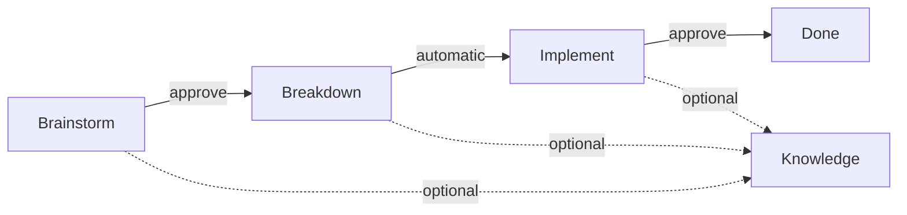

# SpecDev CLI

Spec-driven workflow guidance for coding agents. SpecDev installs a local `.specdev/` workflow, agent command skills, and a CLI that keeps assignments moving through brainstorm, breakdown, implementation, review, and optional phase-end knowledge capture.


```mermaid
graph LR
    B[Brainstorm] -->|approve| D[Breakdown]
    D -->|automatic| I[Implement]
    I -->|approve| Done[Done]
    B -.optional.-> K[Knowledge]
    D -.optional.-> K
    I -.optional.-> K
```

## Quick Start

```bash
npm install -g github:leiwu0227/specdev-cli
specdev init
```

Command skills are installed to `.claude/skills/` and `.codex/skills/`. Platform adapters are also written for Claude Code, Codex, and Cursor. Use `specdev-start` to fill in your project context interactively, then `specdev-assignment` to begin your first feature. You can also run the CLI commands directly from a terminal or coding agent.

## Commands

### CLI commands (run from terminal)

```bash
specdev init                           # Initialize .specdev in current directory
specdev update                         # Update core skills, preserve project files
specdev migrate                         # Guided .specdev layout migration workflow
specdev migrate legacy-assignments --dry-run
specdev skills                         # List available skills
specdev skills --json                  # Machine-readable skill inventory
specdev skills view <name> [path]      # Print a skill file or support file
specdev skills install                 # Install tool skills with agent wrappers
specdev skills remove <name>           # Remove an installed tool skill
specdev skills sync                    # Reconcile active tools with available skills
specdev memory refresh                 # Regenerate bounded working memory
specdev knowledge index                # Rebuild SQLite knowledge retrieval cache
specdev knowledge search <query>       # Search indexed SpecDev knowledge
specdev knowledge list                 # List knowledge files
specdev help                           # Show usage information
```

### Agent-directed commands (run inside a coding agent)

```bash
specdev assignment [name]              # Create assignment, route agent to brainstorming skill
specdev focus <id>                     # Set the active assignment
specdev discussion [name]              # Start a parallel brainstorming discussion
specdev checkpoint <phase>             # Validate phase artifacts (brainstorm | implementation)
specdev approve <phase>                # Hard gate: approve a phase
specdev reviewloop <phase>             # Automated external review loop (brainstorm | implementation)
specdev reviewloop <phase> --reviewer=<name> --autocontinue
                                        # Review, approve on pass, then follow next-action contract
specdev implement                      # Set up and kick off implementation after breakdown
specdev revise                         # Archive downstream artifacts, re-enter brainstorm
specdev check-review                   # Read and address review feedback
```

### Either context (useful in both terminal and agent sessions)

```bash
specdev start                          # Check/fill project context
specdev continue [--json]              # Detect current state, blockers, and next action
specdev next --json                    # Canonical next-action contract for agents
specdev status [--json]                # Show workflow state for humans or automation
specdev review <phase>                 # Manual review in a separate session
specdev context [--json]               # Dump project state, commands, knowledge, and skills
```

## What gets created

```text
.specdev/
├── _main.md                  # Workflow entry point (start here)
├── _index.md                 # Detailed lookup for guides, skills, commands
├── _guides/                  # Workflow and task guides
├── _templates/               # Templates and worked examples
├── skills/
│   ├── core/                 # Phase skills + supporting skills (managed by specdev update)
│   └── tools/                # Tool skills (e.g., reviewloop — managed by specdev update)
├── knowledge/                # Long-term project knowledge
├── project_notes/            # Project context and progress
├── project_scaffolding/      # Source mirror metadata
├── assignments/              # Active work
└── discussions/              # Parallel brainstorm threads
```

## Workflow Architecture

SpecDev guides a single coding agent through a 3-phase workflow. Each phase produces specific artifacts. The CLI enforces hard gates between phases so work cannot advance until artifacts are validated and the user approves. Agents use `specdev next --json` as the canonical source for the next action.

Breakdown runs automatically — the user only approves brainstorm and implementation. Optional review (manual or automated via reviewloop) can be run before either approval gate. Optional phase-end knowledge capture can suggest durable notes without blocking progress.

## The 3 Phases

All work happens through assignments in `.specdev/assignments/<id>/`.

### 1. Brainstorm

Skill: `skills/core/brainstorming/SKILL.md`

Interactive Q&A with the user to validate scope and design. Questions are guided by category (problem/goal, scope boundaries, success criteria, etc.). Design sections are scaled by assignment type (feature, bugfix, refactor, familiarization).

**Produces:** `brainstorm/proposal.md` + `brainstorm/design.md`

**Gate:** `specdev approve brainstorm` — after approval, use `specdev next --json`.

### 2. Breakdown (automatic)

Skill: `skills/core/breakdown/SKILL.md`

Runs automatically after brainstorm approval. Decomposes the design into a concise plan of coherent implementation tasks. Each task declares mode, files, work, verification, test budget, and pruning guidance. The plan declares whether execution should be inline, subagent-based, or parallel. Internal subagent review validates the plan (1-2 rounds).

**Produces:** `breakdown/plan.md`

### 3. Implement

Skill: `skills/core/implementing/SKILL.md`

Tasks run using the plan's execution mode. The default is inline execution by the current agent; plans can opt into fresh subagents per task or parallel worktrees when task boundaries are clean. Verification scales by task mode: lightweight defers executable tests to final verification, standard uses focused tests for behavior changes, and full uses strict TDD plus reviewer handoff.

**Produces:** code changes, `implementation/progress.json`

**Gate:** `specdev approve implementation` — after approval, use `specdev next --json`.

## Optional Phase-End Knowledge Capture

Skill: `skills/core/knowledge-capture/SKILL.md`

After brainstorm, breakdown, or implementation, SpecDev may suggest a non-blocking knowledge capture hook. Agents should record knowledge only when there is reusable information for future assignments.

Before writing knowledge, agents must run `specdev knowledge search "<topic>"`, prune or replace stale nearby notes, and ask the user before updating `knowledge/` or `project_notes/`.

## Optional Review Before Approval

Before either approval gate, users can optionally review:

| Command | What it does |
|---------|-------------|
| `specdev checkpoint <phase>` | Validate required artifacts exist |
| `specdev review <phase>` | Manual review in a separate session |
| `specdev reviewloop <phase>` | Automated external review via CLI (e.g., Codex) |
| `specdev reviewloop <phase> --reviewer=<name> --autocontinue` | Automated review, then follow the next-action contract after approval |
| `specdev reviewloop <phase> --preflight --reviewer=<name> --json` | Check reviewer readiness without launching the reviewer |

## Assignment Folder Structure

```text
.specdev/assignments/<id>/
├── brainstorm/
│   ├── proposal.md              # What was requested
│   └── design.md                # Validated design
├── breakdown/
│   └── plan.md                  # Executable task list
├── implementation/
│   └── progress.json            # Task completion tracking
└── review/
    ├── brainstorm-feedback.md   # Append-only brainstorm review findings
    ├── brainstorm-changelog.md  # Fix summary for brainstorm re-review
    ├── implementation-feedback.md
    └── implementation-changelog.md
```

## Skills Model

Skills are modular capabilities in `.specdev/skills/`:

```text
skills/core/<name>/
  SKILL.md        # The manual (with frontmatter)
  scripts/        # Deterministic tools (bash)
  prompts/        # Subagent templates
```

**Core skills** (`skills/core/`) — managed by SpecDev, updated via `specdev update`:

| Skill | Type | Purpose |
|-------|------|---------|
| `brainstorming` | Phase | Interactive design Q&A |
| `breakdown` | Phase | Design to executable plan |
| `implementing` | Phase | Task execution with risk-scaled verification |
| `review-agent` | Phase | Holistic review (separate session) |
| `knowledge-capture` | Optional hook | Phase-end reusable knowledge capture |
| `test-driven-development` | Supporting | Red-Green-Refactor enforcement |
| `systematic-debugging` | Supporting | Root-cause-first bugfix |
| `parallel-worktrees` | Supporting | Git worktree isolation |
| `investigation` | Supporting | Codebase exploration and understanding |
| `diagnosis` | Supporting | Bug diagnosis and root cause analysis |
| `verification-before-completion` | Always-apply | No claims without evidence |
| `receiving-code-review` | Always-apply | No performative agreement |

**Tool skills** (`skills/tools/`) — managed by SpecDev for official tools (e.g., reviewloop), user-owned for custom tools:

| Skill | Purpose |
|-------|---------|
| `reviewloop` | Automated external review loop (Codex, etc.) |

## Updating

```bash
npm install -g github:leiwu0227/specdev-cli
specdev update
```

`specdev update` refreshes core skills, official tool skills, and system guides while preserving project-specific files.

## Acknowledgments

TDD enforcement and verification patterns adapted from [obra/superpowers](https://github.com/obra/superpowers).

## License

MIT
